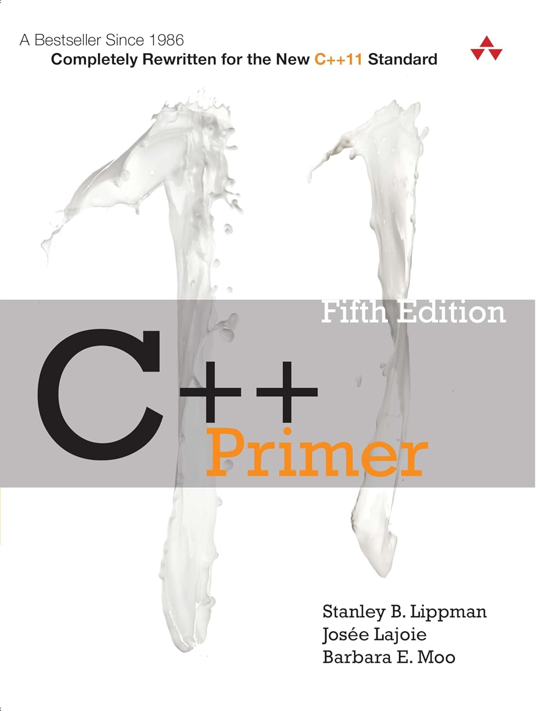

# C++ Primer 5th Edition Exercises

This directory contains comprehensive exercises for C++ Primer 5th Edition, organized by chapter and topic. All exercises follow modern C++ practices and the pedagogical approach of the teaching philosophy.

## About the Book

**C++ Primer** by Stanley Lippman, Josée Lajoie, and Barbara Moo is a bestselling programming tutorial and reference completely rewritten for the new C++11 standard.

Fully updated and recast for the newly released C++11 standard, this authoritative and comprehensive introduction to C++ will help you to learn the language fast, and to use it in modern, highly effective ways. Highlighting today's best practices, the authors show how to use both the core language and its standard library to write efficient, readable, and powerful code.

The book introduces the C++ standard library from the outset, drawing on its common functions and facilities to help you write useful programs without first having to master every language detail. Many examples have been revised to use the new language features and demonstrate how to make the best use of them.

This book is a proven tutorial for those new to C++, an authoritative discussion of core C++ concepts and techniques, and a valuable resource for experienced programmers, especially those eager to see C++11 enhancements illuminated.


## Overview

These exercises are designed to help students learn C++ concepts through hands-on practice. Each exercise provides conceptual guidance in TODO comments rather than code solutions, encouraging active learning through implementation.

All exercises are designed to run in a Linux/Docker environment and follow the pedagogical approach of providing conceptual guidance in TODO comments rather than code solutions, helping students learn through active implementation.

## Exercise Structure

Each exercise follows a consistent template structure:
- `src/` - Contains exercise and solution source files
- `test/` - Contains basic and practice test files
- `CMakeLists.txt` - Build configuration
- `README.md` - Detailed instructions and learning objectives
- `build.sh` - Build script for Linux/Docker environments
- `run_tests.sh` - Test execution script

## Prerequisites

Before building and running these exercises, you need to install the required tools:
- [Windows Setup Instructions](doc/PREREQUISITES_WINDOWS.md)
- [macOS Setup Instructions](doc/PREREQUISITES_MACOS.md)
- [Linux/WSL Setup Instructions](doc/PREREQUISITES_LINUX.md)

## Teaching Philosophy

Learn about the [teaching philosophy](doc/TEACHING_PHILOSOPHY.md) behind these exercises, including our core principles and implementation approach.

## Chapters with Exercises

### Chapter 1: Getting Started
- [1 Hello World](1.hello_world/)

### Chapter 2: Variables and Basic Types
- [2 Variables and Types](2.variables_and_types/)

### Chapter 3: Strings, Vectors, and Arrays
- [3.1 Arrays and Strings](3.1.arrays_strings/)
- [3.2 String Library Functions](3.2.string_library_functions/)
- [3.3 Array and String Algorithms](3.3.array_string_algorithms/)

### Chapter 4: Expressions
- [4 Expressions and Statements](4.expressions_statements/)

### Chapter 5: Statements
- [5 Control Flow](5.control_flow/)

### Chapter 6: Functions
- [6 Functions](6.functions/)

### Chapter 7: Classes
- [7 Classes](7.classes/)

### Chapter 8: The IO Library
- [8 IO Library](8.io_library/)

### Chapter 9: Sequential Containers
- [9 Sequential Containers](9.sequential_containers/)

### Chapter 10: Generic Algorithms
- [10 Generic Algorithms](10.generic_algorithms/)

### Chapter 11: Associative Containers
- [11 Associative Containers](11.associative_containers/)

### Chapter 12: Dynamic Memory
- [12 Dynamic Memory](12.dynamic_memory/)

### Chapter 13: Copy Control
- [13 Copy Control](13.copy_control/)

### Chapter 14: Overloaded Operations and Conversions
- [14 Overloaded Operations](14.overloaded_operations/)

### Chapter 15: Object-Oriented Programming
- [15 Object-Oriented Programming](15.object_oriented_programming/)

### Chapter 16: Templates and Generic Programming
- [16 Templates and Generic Programming](16.templates_generic_programming/)

### Chapter 17: Specialized Library Facilities
- [17 Specialized Library Facilities](17.specialized_library_facilities/)

### Chapter 18: Tools for Large Programs
- [18 Tools for Large Programs](18.tools_for_large_programs/)

### Chapter 19: Specialized Tools and Techniques
- [19 Specialized Tools and Techniques](19.specialized_tools_techniques/)

### Chapter 20: The New Standard Library
- [20 New Standard Library](20.new_standard_library/)

## Building and Testing

Each exercise can be built and tested using the provided shell scripts:

```bash
# Navigate to any exercise directory
cd chapter.section.exercise_name

# Build the exercise
./build.sh

# Run the exercise solution
./build/exercise_name_solutions

# Run tests
./run_tests.sh
```

Note: These exercises are designed to run in a Linux/Docker environment. Windows batch files are not provided.