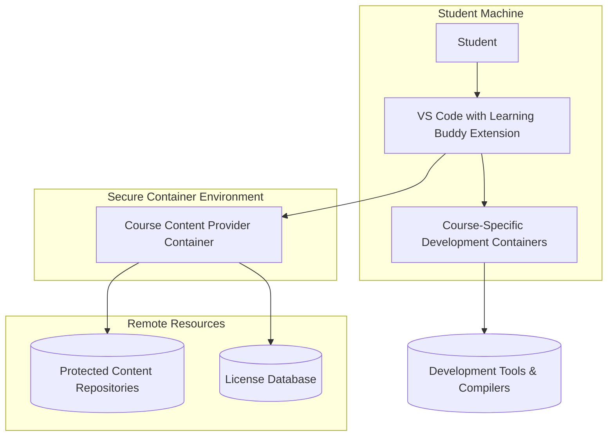

# Programming Learning VS Code Buddy - Learning Buddy Extension Platform

The Learning Buddy Extension Platform is an innovative educational system that transforms how students learn programming directly within Visual Studio Code. This platform consists of multiple components working together to provide a secure, efficient, and engaging learning experience.

## Platform Architecture

The Learning Buddy Extension Platform comprises three core components that work seamlessly together:

### 1. Generic Learning Buddy Extension (Main Component)
The Generic Learning Buddy Extension is a single VS Code extension that can dynamically load and present content for multiple courses. Rather than requiring separate extensions for each course, this unified approach allows students to:
- Access multiple courses from a single installation
- Switch between different programming languages and topics
- Maintain a consistent learning interface across all subjects
- Discover new courses through built-in course catalogs

### 2. Course-Specific Learning Buddy Extensions (Specialized Variants)
For educators who prefer dedicated extensions for their specific courses, the platform supports building course-specific variants (e.g., "C++ Primer 5th Edition Buddy", "Python Fundamentals Buddy"). These extensions:
- Focus exclusively on one course's content
- Include custom branding and course metadata
- Provide a streamlined experience for specific learning paths
- Still leverage the same secure backend infrastructure

### 3. Course Content Provider (Secure Backend Service)
The Course Content Provider is a Python-based service that runs within a Podman container, serving as the secure backend for all course materials. It handles:
- License verification and management
- Protected content delivery directly to development environments
- Course catalog management and discovery
- Anti-bulk copying measures to protect educational materials
- Usage tracking and download limits
- Dynamic course structure generation by scanning downloaded materials

## How Components Interact

The Learning Buddy Extension Platform uses a secure, containerized architecture to deliver an efficient learning experience:



1. **Student Interaction**: Students interact with the Learning Buddy Extension directly in VS Code, browsing course content and accessing exercises.

2. **Content Requests**: When accessing protected content, the extension communicates with the Course Content Provider running in a Podman container.

3. **License Verification**: The Course Content Provider verifies licenses and enforces download limits to protect content.

4. **Secure Delivery**: Approved content is delivered directly to course-specific development environments (also Podman containers) without storing protected materials on the host system.

5. **Development Environment**: Students work on exercises in isolated, course-specific development environments that contain all necessary tools and compilers.

## Embedded Podman Architecture

The Learning Buddy Extension Platform implements an embedded Podman strategy to provide a seamless user experience. See [EMBEDDED_PODMAN.md](EMBEDDED_PODMAN.md) for detailed information about:

- How Podman is embedded directly in the extension
- Automatic container management and startup
- Platform-specific implementation details
- Error handling and fallback mechanisms

## Enhanced User Experience: Persistent Installation Instructions

When Podman is not installed or not available on the user's system, the extension now displays persistent installation instructions directly in the Learning Buddy panel instead of transient popup dialogs. This enhancement improves the user experience by providing clear, always-visible guidance on how to resolve the Podman dependency issue.

The panel shows:
- Clear explanation of why Podman is required
- Step-by-step installation instructions
- Direct links to platform-specific installation guides
- Contact support option for additional help

This approach ensures users always know what to do when Podman is missing, rather than having to remember transient error messages.

## Course Structure Management

The platform includes two complementary features for course structure management:

1. **Course Structure Tool**: A development-time tool for course creators to validate repositories and generate course-structure.json files. See [015-course-structure-tool specification](.specify/specs/015-course-structure-tool/spec.md) for details.

2. **Dynamic Course Structure Generation**: A runtime feature where the Course Content Provider automatically scans downloaded course materials to generate course structure. See [014e-dynamic-course-structure specification](.specify/specs/014e-dynamic-course-structure/spec.md) for details.

For a complete explanation of the design decision to keep these features separate but complementary, see [COURSE_STRUCTURE_FEATURES.md](COURSE_STRUCTURE_FEATURES.md).

## Why This Extension is Excellent for Students

### Enhanced Security and Content Protection
- Protected course materials never touch the host filesystem
- All content delivery happens within secure Podman containers
- License-based access control prevents unauthorized sharing

### Streamlined Development Workflow
- One-click setup of complete development environments
- Automatic configuration of compilers, libraries, and tools
- No manual environment setup or dependency conflicts

### Efficient Learning Experience
- Direct integration with VS Code's powerful editing features
- Context-sensitive help and hints within the IDE
- Progress tracking to monitor learning achievements
- Quick access to solutions and learning guides

### Flexible Course Access
- Access multiple courses from a single extension
- Switch between different programming languages and topics
- Discover new learning opportunities through course catalogs

### Reliable Environment Isolation
- Course-specific development environments prevent conflicts
- Consistent tool versions across all students
- Eliminates "works on my machine" issues

## Features

- **Interactive Learning**: Step-by-step guidance through programming exercises
- **Automated Environment Setup**: One-click setup of development environments using Podman
- **License Management**: Secure access to protected content with license verification
- **Progress Tracking**: Monitor your learning progress through courses
- **Multi-Course Support**: Access multiple courses from a single extension
- **Secure Content Delivery**: Protected materials delivered directly to development containers
- **Dynamic Course Navigation**: Automatic course structure generation at runtime
- **Persistent Installation Guidance**: Clear, always-visible instructions when Podman is not available

## Requirements

- Visual Studio Code
- Node.js and npm
- Python 3.12 (for Course Content Provider)

Note: Podman is embedded within the extension, eliminating the need for separate installation.

## Installation

1. Clone this repository
2. Install dependencies:
   ```bash
   npm install
   ```
3. Build the extension:
   ```bash
   npm run build
   ```
4. Install the extension in VS Code

## Course Content Provider Setup

To set up and run the Course Content Provider service:

1. Navigate to the course-content-provider directory:
   ```bash
   cd course-content-provider
   ```

2. Create and activate the conda environment:
   ```bash
   conda create -n liugejiao python=3.12
   conda activate liugejiao
   ```

3. Install dependencies:
   ```bash
   pip install .
   ```

4. Run the service:
   ```bash
   course-content-provider
   ```

   Or use the startup scripts:
   ```bash
   ./start.sh        # On Linux/Mac
   start.bat         # On Windows
   ```

5. The service will be available at `http://localhost:8000`

## Container Deployment

The Course Content Provider can also be run in a Podman container:

```bash
cd course-content-provider
podman build -t course-content-provider -f Podmanfile .
podman run -p 8000:8000 course-content-provider
```

## Development

### Building the Extension

```bash
npm run build
```

### Running Tests

```bash
npm test
```

### Building Course-Specific Extensions

```bash
node build-buddy.js --config examples/cpp-primer-5th-config.json
```

### Building Generic Learning Buddy Extensions

```bash
node build-buddy.js --config examples/python-3rd-edition-config.json
```

## License

This project is licensed under the MIT License - see the [LICENSE](LICENSE) file for details.

## Course Content Provider

For information about the Course Content Provider service, see the [course-content-provider](./course-content-provider/) directory.